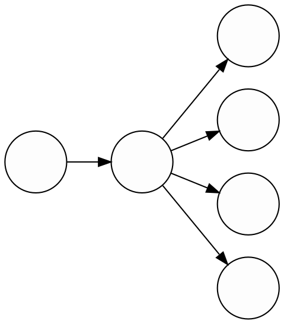
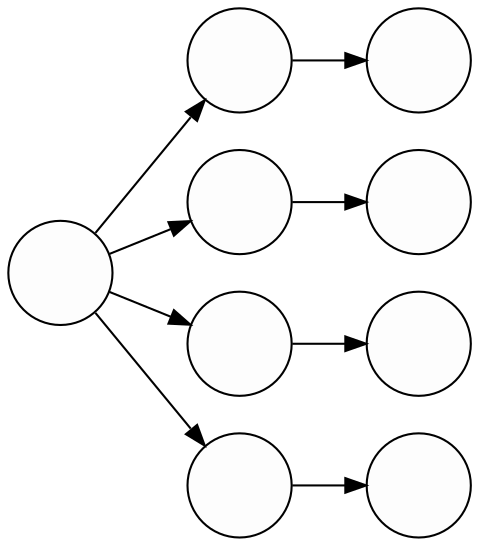

<style>
.Missing {
  text-align: center;
  width:  100%;
  height: 300px;
  background-color: gray;
  border: black 1px;
}
</style>

\def\E#1{\mathbb{E}\left[ #1 \right]}
\def\inner<#1,#2>{\left\langle#1,\,#2\right\rangle}
\def\Scenarios{\mathcal{S}}
\def\Cuts{\mathcal{C}}
\def\Qfrak{\mathfrak{Q}}


By the way, some of the content about [non-convex functions](#ncvx)
comes directly from my [Master's thesis](/masters/), called _Convexification by Averages_.


# Stochastic OVF

$$
  \begin{array}{rl}
    \min\limits_{x} & c_1(x) + \E{Q(x)} \\
    \textrm{s.t.}  & x \in X \\
    Q(x) = \min\limits_{y} & c_2(y) \\
    \textrm{s.t.}   & (x, y) \in Y.
  \end{array}
$$

:::Theorem
The average of a convex random function is also convex.
:::

Convex Stochastic Programs
==========================

To start delving into the world of stochastic programs,
let's consider the _convex_ case.
Hence, throughout this section we will always assume
that the second stage is a random convex optimization problem.
We need to put no restrictions on the first stage,
since we will only need cuts for the future part.
Now it's time to approximate some random functions by cuts.

Thanks to convexity, we can use Lagrangian duality
at each scenario to produce (random) tight cuts at any point of choice.
Suppose we want to calculate our cut at $x_0$.
It defines a random optimal value $Q(x_0)$
but also a dual multiplier $\Lambda$ dependent on the solution of $Q(x_0)$.
This produces the cut we want:

$$ Q(x) \ge Q(x_0) + \inner<\Lambda, x - x_0>.$$

:::Missing
Figure of cuts for random functions
:::

Since expected values preserve inequalities,
this equation is all we need to approximate $\E{Q}$ by cuts.

:::Theorem
The average of tight cuts for a convex random function $Q$ is tight for the average $\E{Q}$.

$$ \E{Q(x)} \ge \E{Q(x_0)} + \inner<\E{\Lambda}, x - x_0>.$$
:::

:::Missing
Average cut + many faded cuts
:::

The theorem above is the key for solving two-stage stochastic programs using cuts.
When the uncertainty has a finite amount of scenarios,
we can calculate the average cut as a two-step process:

- For each scenario $s$, calculate a cut for the (deterministic) sample $Q^s$;
- Combine the optimal values and multipliers into a cut for $\E{Q}$.

For infinite uncertainty, it is possible to use _Sample Average Approximation_
or the law of large numbers to estimate the averages by independently sampling from $Q$.
But this is out of scope for this post.


Single Cut Approach
-------------------

Now that we know how to approximate the average of a random function,
we can use it to construct an algorithm for solving stochastic programs.
The idea is to adapt [Kelley's cutting plane algorithm](/posts/cuts#example-kelley-cutting-planes)
for stochastic programs.

Consider a bag of cuts $\Cuts$ for $\E{Q}$ that starts empty.
From it, we construct a polyhedral underapproximation as

$$ \Qfrak(x) = \max\limits_{(b, \lambda) \in \Cuts} b + \inner<\lambda, x>.$$

This is called a _single cut approximation_ for $\E{Q}$
because it is made only of cuts that directly approximate the average
(But this nomenclature will make no difference until next section,
so let's go back to how to use our new friend to solve stochastic programs.)
With this approximation for the future cost,
we can construct an underapproximation for the total cost as

$$
  \begin{array}{rrl}
    z(\Cuts) &= \min\limits_{x}   & c_1(x) + \Qfrak(x) \\
      &\textrm{s.t.}  & x \in X \\
      &= \min\limits_{x,t} & c_1(x) + t \\
      &\textrm{s.t.}  & x \in X, \\
      &               & t \ge b + \inner<\lambda, x>,\; \forall (\lambda, b) \in \Cuts.
  \end{array}
$$

We are substituting the complicated expected cost-to-go $\E{Q}$
by a bunch of linear constraints, making the problem much easier.
Notice also that if the first stage was convex or an LP, it remains so,
which is a big win in terms of plugging it into a solver.

If $\Qfrak$ is a good approximation of $Q$,
we expect $z(\Cuts)$ to be close to the real optimal $z^\star$.
But what do we do if it isn't?
We get more cuts to improve it, of course!
By using what we discussed in the previous section,
we can calculate tight cuts for $\E{Q}$.
Whenever we solve the first stage, it gives us a solution $x \in X$
that is feasible in the real problem.
We can use it as the parameter to solve
the _deterministic_ optimization problem corresponding to each scenario,

$$
  \begin{array}{rl}
    Q^s(x) = \min\limits_{y} & c_2^s(y) \\
    \textrm{s.t.}   & (x, y) \in Y^s.
  \end{array}
$$

This will produce an optimal value $Q^s(x)$, solution $y^s$, and dual $\lambda^s$.
The average of those defines a tight cut for $\E{Q}$,
which we include into $\Cuts$.
In code, the procedures for calculating a new cut looks like this.

```julia
function average_cut(prog, x)
  v, y, λ = [], [], []   # Value, solution, multiplier

  for s in prog.Scenarios
    v[s], y[s], λ[s] = solve(prog, s, x)
  end

  return Cut(mean(opt), mean(λ), x)
end
```

Until now, our algorithm has two steps,
which corresponds to how the information propagates between the stages:

- Solve the first stage and propagate the primal solution $x$ _forwards_ to the second stage;
- Solve the second stage for each scenario and propagate the average cut _backwards_ to the first stage.



We repeat these forwards-backwards steps until the algorithm converges
to a solution for the original problem.
The only thing remaining is a stopping criterion for us to know when the solution is good enough.
For this, we use that we calculate both primal and dual solutions during the algorithm
to estimate upper and lower bounds over the real optimal.

- **Lower bound:** Since $\Qfrak \le \E{Q}$,
the calculated first stage value is below the real optimal value:
$$z(\Cuts) \le z^\star.$$

- **Upper Bound:** The calculated solutions $x, y^s$ for each stage are feasible,
thus their cost must be above the true minimum:
$$ c_1(x) + \E{c_2(y)} \ge  z^\star.$$

These bounds "sandwich" the true solution and,
when they're closer than a required tolerance,
we can consider our approximation good enough.
The whole procedure is summarized in the code snippet below.

```julia
function solve_single_cut(stage1, stage2; tol = 1e-8)
  v2, y, λ = [], [], []   # Value, solution, multiplier
  ub, lb   = +Inf, -Inf

  while ub - lb > tol
    # First stage
    v1, x = solve(stage1)
    # Second stage
    for s in stage2.Scenarios
      v2[s], y[s], λ[s] = solve(stage2[s], x)
    end
    # Update approximation for E[Q]
    addcut!(stage1, Cut(mean(v2), mean(λ), x))
    # Check the bounds
    lb = opt1
    ub = stage1.cost(x) + mean(v2)
  end

  return x, y   # Calculated optima
end
```


### A Note on Parallelism

Notice on the algorithm above that the second-stage scenarios are independent of each other.
Since solving optimization problems is no simple task,
one use this to distribute the work over multiple processors.


The algorithm is not completely parallel though,
because the processors must synchronize their work to calculate the average cut.
While you can solve $|\Scenarios|$ optimization problems in parallel
in the second stage,
the process of gathering their results to produce a cut,
updating the first-stage problem and solving it to get a new solution is synchronous.
While only one processor runs this part, all others must wait.

In the next section we will learn a more flexible representation for the cost-to-go
that, at the cost of more memory usage, overcomes this limitation.


Multicut Approach
-----------------

In the single cut approach,
we calculate one cut per iteration to directly approximate the cost-to-go $\E{Q}$.
Thus, in a sense, approximating the average is the second stage's job:
the first stage never sees any information regarding the different scenarios,
it already comes aggregated to it.

Another possibility is to use a __multicut approximation__
where we keep a bag of cuts $\Cuts^s$ for each scenario
and construct separate approximations

$$ \Qfrak^s(x) = \max\limits_{(b, \lambda) \in \Cuts^s} b + \inner<\lambda, x>.$$

Now it is the first stage's job to take these approximations
and convert into an approximation to $\E{Q}$.
We do this by noticing that

$$ \Qfrak^s \le Q^s \implies \sum_{s \in \Scenarios} p_s \Qfrak^s \le \E{Q}$$

And plugging this whole average expression into our first stage approximation.

$$
  \begin{array}{rrl}
    z(\Cuts) &= \min\limits_{x}   & c_1(x) + \sum_{s \in \Scenarios} p_s \Qfrak^s(x) \\
      &\textrm{s.t.}  & x \in X \\
      &= \min\limits_{x,t} & c_1(x) + \sum_{s \in \Scenarios} p_s t_s \\
      &\textrm{s.t.}  & x \in X, \\
      &               & t_s \ge b + \inner<\lambda, x>,\; \forall s \in \Scenarios, (\lambda, b) \in \Cuts^s.
  \end{array}
$$

The multicut approach defines a larger optimization problem
than the one we had for the single cut,
because it unlinks the cost-to-go for each scenario.



We can use this structure to build a similar algorithm to our previous one.
The main difference is that the multicut solver adds the cuts immediately after completing each scenario.

```julia
function solve_multicut(stage1, stage2; tol = 1e-8)
  v2, y, λ = [], [], []   # Value, solution, multiplier
  ub, lb   = +Inf, -Inf

  while ub - lb > tol
    # First stage
    v1, x = solve(stage1)
    # Second stage
    for s in stage2.Scenarios
      v2[s], y[s], λ[s] = solve(stage2[s], x)
      # Update approximation for E[Q[s]]
      addcut!(stage1, s, Cut(v2[s], λ[s], x))
    end
    # Check the bounds
    lb = opt1
    ub = stage1.cost(x) + mean(v2)
  end

  return x, y   # Calculated optima
end
```

### Flexibility and parallelism

The advantage of representing each scenario separately in the first-stage is the flexibility it gains us.
Suppose, for example, that there is a scenario with a value function that's more complicated than the others.
In the single cut approach we have to solve all scenarios to obtain an average cut,
and, therefore, cannot focus on the problematic one.
With separate cut bags, on the other hand, it is possible to adapt the algorithm
to sample more often the scenarios known to be harder.

This idea is particularly useful when parallelizing the algorithm
because it doesn't require a synchronicity bottleneck for calculating average cuts.
We could, for example, assign some scenarios for each worker
and a processor responsible for solving the first stage from time to time.
As soon as a worker produces a cut, it can send it over to the first stage
to improve its approximation.


Non-Convexity under Uncertainty {#ncvx}
=======================================

It is time to leave the peaceful and colorful land of convexity
to enter the dark and haunted land of general, not necessarily convex, functions.
Recall from the [previous post](/posts/cuts) that for an arbitrary deterministic function,
the best we can get is a tight cut for its convex relaxation (dual function).
Since the expected cost-to-go $\E{Q}$ is deterministic,
we must accept that the best we can do approximate its relaxation $\E{Q}$,

$$\E{Q}(x) \ge \widecheck{\E{Q}}(x_0) + \inner<\lambda, x - x_0>.$$

Nevertheless,
our current strategy of solving $Q$ for each scenarios and, only in the end, constructing the average cut
from all results is, in general, worse than we expect, because it has no guarantee of being tight for $\widecheck{\E{Q}}$.
The problem is that the random cut is only tight for $\check{Q}$[^dual-random]

$$Q(x) \ge \check{Q}(x_0) + \inner<\Lambda, x - x_0>$$

And by taking the average we get a cut that is tight for the _average of convexifications_ $\E{\check{Q}}$.
Our central theorem in this section is that $\mathbb{E}$ and $\widecheck{(\cdot)}$ do not necessarily commute.


[^dual-random]: The random convexification $\check{Q}$ is defined as the convexification for each sample: $(\check{Q})^s = \widecheck{(Q^s)}$.
This is just a notation to make everything cleaner.

:::Theorem
The average of convexifications is less than the average's convexification.

$$ \E{\check{Q}} \le \widecheck{\E{Q}} \le \E{Q}.$$
:::

:::Proof
$\E{\check{Q}}$ is a convex underapproximation of $\E{Q}$ because
the expected value preserves inequalities and convexity:

- **Convex**: Each $\check{Q}$ is convex, and their average $\E{\check{Q}}$ is a non-negative linear combination of them;
- **Underapproximation:** $\check{Q} \le Q \implies \E{\check{Q}} \le \E{Q}$.

However, the convex relaxation is defined as uniformly the _largest_ convex underapproximation of $Q$.
Thus, it must be everywhere above $\E{\check{Q}}$.
:::

:::Missing
Compare EQ and convs
:::

## Linked formulation

# Other risk-measures

