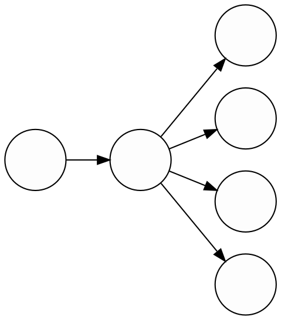

\def\E#1{\mathbb{E}\left[ #1 \right]}
\def\inner<#1,#2>{\left\langle#1,\,#2\right\rangle}
\def\Scenarios{\mathcal{S}}
\def\Cuts{\mathcal{C}}
\def\Qfrak{\mathfrak{Q}}

# Stochastic OVF

$$
  \begin{array}{rl}
    \min\limits_{x} & c_1(x) + \E{Q(x)} \\
    \textrm{s.t.}  & x \in X \\
    Q(x) = \min\limits_{y} & c_2(y) \\
    \textrm{s.t.}   & (x, y) \in Y.
  \end{array}
$$

Convex Stochastic Programs
==========================

To start delving into the world of stochastic programs,
let's consider the _convex_ case.
Hence, throughout this section we will always assume
that the second stage is a random convex optimization problem.
We need to put no restrictions on the first stage,
since we will only need cuts for the future part.
Now it's time to approximate some random functions by cuts.

Thanks to convexity, we can use Lagrangian duality
at each scenario to produce (random) tight cuts at any point of choice.
Suppose we want to calculate our cut at $x_0$.
It defines a random optimal value $Q(x_0)$
but also a dual multiplier $\Lambda$ dependent on the solution of $Q(x_0)$.
This produces the cut we want:

$$ Q(x) \ge Q(x_0) + \inner<\Lambda, x - x_0>.$$

Since expected values preserve inequalities,
this equation is all we need to approximate $\E{Q}$ by cuts.

:::Theorem
The average of tight cuts for a convex random function $Q$ is tight for the average $\E{Q}$.

$$ \E{Q(x)} \ge \E{Q(x_0)} + \inner<\E{\Lambda}, x - x_0>.$$
:::

The theorem above is the key for solving two-stage stochastic programs using cuts.
When the uncertainty has a finite amount of scenarios,
we can calculate the average cut as a two-step process:

- For each scenario $s$, calculate a cut for the (deterministic) sample $Q^s$;
- Combine the optimal values and multipliers into a cut for $\E{Q}$.

For infinite uncertainty, it is possible to use _Sample Average Approximation_
or the law of large numbers to estimate the averages by independently sampling from $Q$.
But this is out of scope for this post.


Single Cut Approach
-------------------

Now that we know how to approximate the average of a random function,
we can use it to construct an algorithm for solving stochastic programs.
The idea is to adapt [Kelley's cutting plane algorithm](/posts/cuts#example-kelley-cutting-planes)
for stochastic programs.

Consider a bag of cuts $\Cuts$ for $\E{Q}$ that starts empty.
From it, we construct a polyhedral underapproximation as

$$ \Qfrak(x) = \max\limits_{(b, \lambda) \in \Cuts} b + \inner<\lambda, x>.$$

This is called a _single cut approximation_ for $\E{Q}$
because it is made only of cuts that directly approximate the average
(But this nomenclature will make no difference until next section,
so let's go back to how to use our new friend to solve stochastic programs.)
With this approximation for the future cost,
we can construct an underapproximation for the total cost as

$$
  \begin{array}{rrl}
    z(\Cuts) &= \min\limits_{x}   & c_1(x) + \Qfrak(x) \\
      &\textrm{s.t.}  & x \in X \\
      &= \min\limits_{x,t} & c_1(x) + t \\
      &\textrm{s.t.}  & x \in X, \\
      &               & t \ge b + \inner<\lambda, x>,\; \forall (\lambda, b) \in \Cuts.
  \end{array}
$$

We are substituting the complicated expected cost-to-go $\E{Q}$
by a bunch of linear constraints, making the problem much easier.
Notice also that if the first stage was convex or an LP, it remains so,
which is a big win in terms of plugging it into a solver.

If $\Qfrak$ is a good approximation of $Q$,
we expect $z(\Cuts)$ to be close to the real optimal $z^\star$.
But what do we do if it isn't?
We get more cuts to improve it, of course!
By using what we discussed in the previous section,
we can calculate tight cuts for $\E{Q}$.
Whenever we solve the first stage, it gives us a solution $x \in X$
that is feasible to the real problem.
We can use it as the parameter to solve
the _deterministic_ optimization problem corresponding to each scenario,

$$
  \begin{array}{rl}
    Q^s(x) = \min\limits_{y} & c_2^s(y) \\
    \textrm{s.t.}   & (x, y) \in Y^s.
  \end{array}
$$

This will produce an optimal value $Q^s(x)$, solution $y^s$, and dual $\lambda^s$.
The average of those defines a tight cut for $\E{Q}$,
which we include into $\Cuts$.
In code, the procedure for a new cut looks like this.

```julia
function average_cut(prog, x)
  v, y, λ = [], [], []   # Value, solution, multiplier

  for s in prog.Scenarios
    v[s], y[s], λ[s] = solve(prog, s, x)
  end

  return Cut(mean(opt), mean(λ), x)
end
```

Until now, our algorithm has two steps,
which corresponds to how the information propagates between the stages:

- Solve the first stage and propagate the primal solution $x$ _forwards_ to the second stage;
- Solve the second stage for each scenario and propagate the average cut _backwards_ to the first stage.



We repeat these forwards-backwards steps until the algorithm converges
to a solution for the original problem.
The only thing remaining is a stopping criterion for us to know when the solution is good enough.
For this, we use that we calculate both primal and dual solutions during the algorithm
to estimate upper and lower bounds over the real optimal.

- **Lower bound:** Since $\Qfrak \le \E{Q}$,
the calculated first stage value is below the real optimal value:
$$z(\Cuts) \le z^\star.$$

- **Upper Bound:** The calculated solutions $x, y^s$ for each stage are feasible,
thus their cost must be above the true minimum:
$$ c_1(x) + \E{c_2(y)} \ge  z^\star.$$

When these bounds are closer than our required tolerance,
we know that we have sandwiched the true solution
and can consider our approximation good enough.
The whole procedure is summarized in the code snippet below.

```julia
function solve_single_cut(stage1, stage2; tol = 1e-8)
  v2, y, λ = [], [], []   # Value, solution, multiplier
  ub, lb   = +Inf, -Inf

  while ub - lb > tol
    # First stage
    v1, x = solve(stage1)
    # Second stage
    for s in prog.Scenarios
      v2[s], y[s], λ[s] = solve(stage2[s], x)
    end
    # Update approximation for E[Q]
    addcut!(stage1, Cut(mean(v2), mean(λ), x))
    # Check the bounds
    lb = opt1
    ub = stage1.cost(x) + mean(v2)
  end

  return x, y   # Calculated optima
end
```


Multicut Approach
-----------------

Non-Convex Is Always More Complicated
=====================================

:::Theorem
The average of convexifications is less than the average's convexification.

$$ \E{\check{Q}} \le \widecheck{\E{Q}} \le \E{Q}.$$
:::

## Linked formulation

# Other risk-measures

