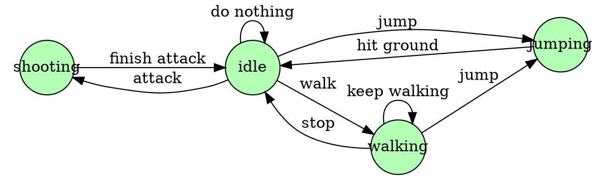
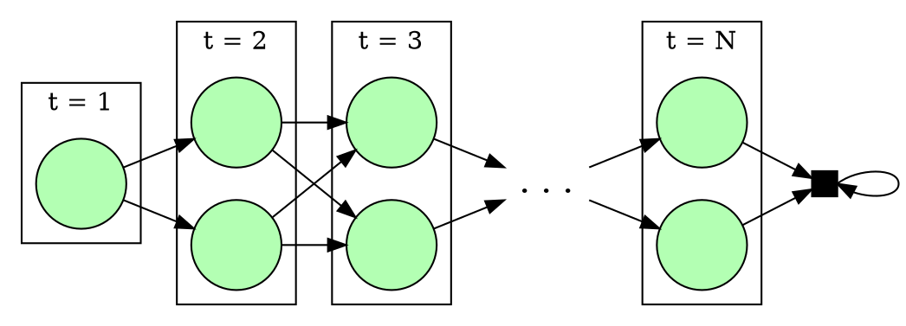
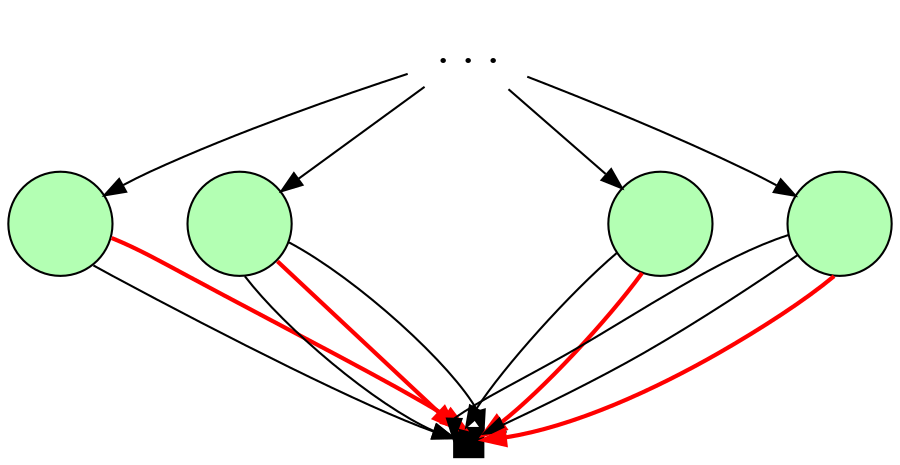
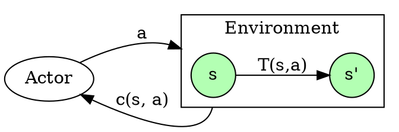

\def\States{\mathcal{S}}
\def\Actions{\mathcal{A}}
\def\R{\mathbb{R}}
\def\E{\mathbb{E}}
\def\Bellman{\mathcal{B}}

What if I told you that some of the most used algorithms to
find the shortest path in a graph,
calculate gradients while training a neural network,
and parse context-free grammars
are essentially implementations of the same principle?
It is called _dynamic programming_ and is one of those instances
in mathematics where a simple principle unfolds
into profound conclusions ranging over many fields.
In fact, we can, already in this first paragraph,
summarize the idea using Richard Bellman's (Dynamic Programming's creator) own words:

> An optimal policy has the property that
whatever the initial state and initial decision are,
the remaining decisions must constitute an optimal policy
with regard to the state resulting from the first decision.

I gotta say that I was taught dynamic programming
in different contexts, but it took me a while
to finally get the "click" that they were actually the same thing.
When learning algorithms and data structures,
it was a memoization-based technique where you speed up your algorithm
by first solving the easier parts and saving them for later use.
At work, I mostly deal with solving a lot of linear programs
for long-term scheduling problems.[^sddp]
The main algorithm we use, called _Stochastic Dual Dynamic Programming_,
at first didn't seem so much like the programming technique algorithms class.
Finally, one of the main methods for model-based reinforcement learning
is again called dynamic programming,
and it also didn't seem so much like the other instances.

So, what's happening here?
Did everybody choose to call their algorithms dynamic programming
just because it's a cool name?[^dp-name]
Well, in fact there are some principles that apply to all of those instances,
from planning a rocket's trajectory to TeX's word-wrapping.
And the [list goes on and on](https://en.wikipedia.org/wiki/Dynamic_programming#Algorithms_that_use_dynamic_programming).

I want to invite you to a journey through many realms of mathematics.
We will range from automata to optimal control,
passing through Markov chains, dynamical systems, linear programming
and even metric spaces.
Take your seat and enjoy the ride!


[^sddp]: To be more precise, we work with hydrothermal dispatch problems,
where one must decide between many sources of energy (hydro, thermal, renewable)
to supply a certain power demand taking into account the uncertainties of the future.
For example: hydro is cheap and clean, but you risk running out of water
if you use all of it and next month turns out particularly dry.
Finding the best energy dispatch is once again solved via dynamic programming.

[^dp-name]: Even Richard Bellman admittedly named it based [on how cool it sounds](https://en.wikipedia.org/wiki/Dynamic_programming#History).

## On Decision Making and State Machines

Before delving into dynamic programming per se, we first have to establish a few concepts.
After all, it's always best to know which problems you intend to solve
before learning a method to solve them, right?


As a matter of motivation, let's start with something I am really fond of:
old school platformer games.
In our hypothetical game which is definitely not about some Italian plumber,
the character does stands idle doing nothing by default.
But with the press of a button in the controller,
the player may command the character to do a few things:
shoot, jump or walk.
And, of course, each of these actions activate the respective animation on the screen.
In the best Resident Evil style,
this game only allows a character to shoot while idle
and also forces you to first be idle after a jump before doing any other action.
Think of that as the time it takes to restore one's balance after falling.
This description may seem overly complicated on text,
but fortunately the nice folks in the Comp Sci department
already invented diagrams that show these transitions nicely.




Our modeling above is an instance of something called
a _state machines_ or _automata_ if you're into Greek words.
There are 4 states in which the vampire can be and at each one
there is an available set of actions to take that may transition him to another state.
More abstractly,
an automaton is a system that can be in one of many _states_ $s \in \States$
and at each state, you can choose among a set of _actions_ $a \in \Actions(s)$
that transition the system to a new state $s' = T(s, a)$,
where $T$ is called the system's _transition function_.

An important notice: If you come from Computer Science,
you are probably most used to _finite_ state machines.
Just know that in our context, the states may be any set.
Some of the algorithms that we will see today
only work for finite state spaces,
but there are others that may even require a continuous space!
An example is SDDP, which uses linear programming duality
and thus requires the state space to be a convex subset of $\R^n$.

### The Dynamics of Decision-Making

Iterating the transition $T$ establishes a dynamics for our system
where we start at an initial state $s$ and by taking a sequence of actions
$a_1, a_2, \ldots$ we walk over the state space.

$$
\begin{aligned}
    s_1     &= s, \\
    s_{t+1} &= T(s_t, a_t).
\end{aligned}
$$

This new view makes our state machine somewhat equivalent
to a controllable dynamical system,
which is another really cool name in my opinion.

As an example, think of a game of Sudoku.
The states are the (partially numbered) boards
and the actions consist of putting a valid number
in a certain coordinate.
You start with some random board and repeatedly
place numbers until you reach a terminal state
where there are no available actions.

One can argue that a state encapsulates
all you must know about your system in order to choose an action,
no matter the previous history nor time step.
Indeed, if those things affect your choice,
then you can without loss of generality model
the problem as a larger system where the state also carries this information.
Thus controlling a dynamic system amounts to
a function $\pi : (s : \States) \to \Actions(s)$
which chooses a valid action for each state.
In the literature this called a _policy_,
in analogy to a government taking actions to run its state.

Unfortunately life is not known for its free lunches
and in most systems, whenever we take action $a$ at state $s$,
there is a certain cost $c(s, a)$ to pay.
Depending on the context this can be, for example,
a real monetary cost (for economic problems),
some total distance (for planning)
or even a negative cost representing a reward.

Thus, by following a policy $\pi$,
we produce a sequence of cost $c(s_t, \pi(s_t))$ for each time step.
We could define the total cost for $\pi$ as the sum of those costs,
but there is an additional detail to notice.
If I gave you something and asked whether you want to pay me today or next year,
which option would you prefer?
Sometimes there are factors such as inflation or interests
that make costs in the future not have the same actual value
as the costs we expend right now.
This prompts us to introduce a problem dependent _discount factor_ $\gamma \in [0, 1]$
such that the total cost for a policy $\pi$ is

$$
\begin{array}{rl}
 v^\pi(s) = & c(s_1, \pi(s_1)) + \gamma c(s_2, \pi(s_2)) + \gamma^2 c(s_3, \pi(s_3)) + \ldots \\
  \textrm{where}  & s_1     = s, \\
                  & s_{t+1} = T(s_t, \pi(s_t)), \\
\end{array}
$$

The equation above defines the _value function_ $v^\pi : \States \to \R$
for a given policy $\pi$.
__Spoiler__: keep an eye on the $v^\pi$,
because later in this post we will find them to be useful tools
closely related to the memoization techniques
that people usually identify with dynamic programming.

Besides its practical interpretation,
the discount factor $\gamma$ also plays a significant role
from the mathematical point of view.
If $|\gamma| < 1$ and the costs are uniformly bounded
(which is the case for a finite action space, for example)
we can guarantee that the series defining $v^\pi$ converges
for any policy and initial state.
That is, suppose that exists $M > 0$ such that

$$\forall s \in \States, a \in \Actions(s),\, |c(s, a)| \le M.$$

This bounds the total cost by a geometric series that cannot blow up,

$$
\sum\limits_{t=1}^\infty \gamma^{t-1}|c(s_t, \pi(s_t))| \le \sum\limits_{t=1}^\infty \gamma^{t-1} M \le \frac{M}{1 - \gamma},
$$

thus guaranteeing that the value function is well-defined.

### Optimal Decisions

Having multiple courses of action possible
prompts us to ask which is the best one possible.
When programming a robot to escape a labyrinth,
you want it to take the least amount of time.
When controlling a spaceship towards the moon,
it is important to guarantee that it will use the least amount of fuel.
When brawling at a bar, you want to knock out your foe
with the least injuries possible.
Must of all, the best policy is the one with
the least cost taking _all time_ into account;
both the present and its future consequences.
For example, sometimes a policy that has a higher cost for the first state
is overall better because it puts us into a more favorable state.
Thus, our problem can be naturally formulated as searching for _optimal policies_:

> Starting at state $s$, find a policy $\pi$ producing the least total cost over time.

Or equivalently in math language:

$$
\begin{array}{rl}
\min\limits_\pi v^\pi(s) =
  \min\limits_{a_t} & \sum\limits_{t=1}^\infty \gamma^{t-1}c(s_t, a_t) \\
  \textrm{s.t.}     & s_1     = s, \\
                    & s_{t+1} = T(s_t, a_t), \\
                    & a_t \in \Actions(s_t).
\end{array}
$$

Right now, this may seem like a big and scary optimization problem
but in fact it contains a lot of structure that we can exploit in order to solve it.
This will be the subject of the next section.
Before we continue,
let's go over a little tangent on how to formulate some classical problems
in this decision making framework.

#### Example: Shortest Path in a Graph

Suppose you are at your hometown
and just received a message from a friend
telling you that there are singing llamas in Cuzco, Peru, right now.
This makes you at the same time incredulous and curious,
so you just pick your favorite bike and get on the road towards Cuzco.
Unfortunately there are no direct bikeways connecting your home to Cuzco,
meaning that you will have to find a route going through other cities.
Also, there is a risk that the llamas will stop to sing at any time
and just go back to their usual behavior of eating grass throughout the mountains.
This prompts you to decide to take the shortest possible path to Cuzco.

The above description is an instance of finding the shortest path in a graph.
In it, we represent each city by a graph node and direct routes between two cities
as a weighted edge where the weight is the distance.
Going from home to Cuzco amounts to finding the path between those two nodes
with the smallest total distance.

The translation from this graph description
to a decision process description is quite straightforward.

* **States**: nodes in the graph.
* **Actions** at state $s$: edges going from $s$ to another node.
* **Transition**: The opposite node on the same edge.
That is, given an edge $s \to s'$, $T(s, s \to s') = s'$.
* **Costs**: $c(s, a)$ is the weight of edge $a$.

Finding the shortest path from $s$ to node $z$
is the same as setting the initial state to $s$ and making $z$
a terminal state of our dynamics.

## Dynamic Programming

Alright, it's finally time to solve those decision problems.
The simplest idea could be to exhaustively search the space of all actions
trying to find the best solution.
Notice that even for finite states and horizon, this may be prohibitively expensive
since the possible candidates grow exponentially with the time steps.
Any practical method will take into account how this class of problems
naturally breaks apart into separate stages.

Our approach will involve the famous _Bellman principle of optimality_,
which is the cornerstone of dynamic programming.
Taking @{bellmanDPBook} [ch 3, p. 83]'s own words, it reads as:

> An optimal policy has the property that
whatever the initial state and initial decision are,
the remaining decisions must constitute an optimal policy
with regard to the state resulting from the first decision.

Alright, what does this mean?
What the principle of optimality is telling us
is that in order to calculate an optimal policy,
we should turn this iterative process of making actions and calculating costs
into a recursive procedure.
That is, taking an action puts us into a new state $s_2 = T(s_1, a_1)$
where we are again faced with the exact same problem of finding an optimal policy
but this time starting at $s_2$.
Let's see how we can exploit this idea.

Remember that we defined the value function $v^\pi$
as the total cost of following a policy $\pi$
when starting at a given state.
Let's define the _optimal value function_ $v^\star$
as the total cost of choosing the best course of action
while starting at a certain state $s$.

$$
\begin{array}{rl}
 v^\star(s) =
  \min\limits_{a_t} & \sum\limits_{t=1}^\infty \gamma^{t-1}c(s_t, a_t) \\
  \textrm{s.t.}     & s_1     = s, \\
                    & s_{t+1} = T(s_t, a_t), \\
                    & a_t \in \Actions(s_t).
\end{array}
$$

Notice in the optimization problem above
that the initial state is only ever used to choose the first action.
Later actions do not depend directly on it but only on its consequences.
This means that we can break the problem into two parts:
calculating an _immediate cost_ dependent on the initial state
and calculating a future cost dependent on all next states.

$$
\begin{array}{rl}
 v^\star(s) =
  \min\limits_{a,a_t} & c(s, a) + \left(
    \begin{array}{rl}
      \min\limits_{a_t} & \sum\limits_{t=2}^\infty \gamma^{t-1}c(s_t, a_t) \\
      \textrm{s.t.}     & s_2 = s', \\
                        & s_{t+1} = T(s_t, a_t), \\
                        & a_t \in \Actions(s_t)
    \end{array}
  \right) \\
  \textrm{s.t.} & s' = T(s, a), \\
                 & a \in \Actions(s).
\end{array}
$$

There's already some recursive structure unfolding in here!
What is still missing consists of noticing that since the sum in the future cost
starts at $t =2$, we can factor out $\gamma$.
By renaming $l = t-1$ we get

$$
\sum\limits_{t=2}^\infty \gamma^{t-1}c(s_t, a_t)
= \gamma \sum\limits_{t=2}^\infty \gamma^{t-2}c(s_t, a_t)
= \gamma \sum\limits_{l=1}^\infty \gamma^{l-1}c(s_l, a_l),
$$

and applying this in the expression for $v^\star$,

$$
\begin{array}{rl}
 v^\star(s) =
  \min\limits_{a} & c(s, a) + \gamma\left(
    \begin{array}{rl}
      \min\limits_{a_l} & \sum\limits_{l=1}^\infty \gamma^{l-1}c(s_l, a_l) \\
      \textrm{s.t.}     & s_1 = s', \\
                        & s_{l+1} = T(s_l, a_l), \\
                        & a_l \in \Actions(s_l)
    \end{array}
  \right) \\
  \textrm{s.t.}  & s' = T(s, a), \\
                 & a \in \Actions(s).
\end{array}
$$

Although this is a huge expression,
it should be straightforward to see that the expression
for the future cost is _exactly_ the optimal value $v^\star(s')$
of starting the dynamics at $s' = T(s, a)$.
This way, the principle of optimality express itself mathematically
as a recursive equation that the value for an optimal policy must satisfy.

$$
\begin{array}{rl}
 v^\star(s) =
  \min\limits_{a} & c(s, a) + \gamma v^\star(s') \\
  \textrm{s.t.}  & s' = T(s, a), \\
                 & a \in \Actions(s).
\end{array}
$$

This is called the _Bellman equation_ and all dynamic programming
consists of methods for solving it.
Even more: we can think of the Bellman equation as a recursive specification
for the decision problems and of dynamic programming
as any problem-specific implementation that solves it.

### Existence, Uniqueness and Fixed Points {#fixed-point}

It is time to get deeper into analysis.
Whenever mathematicians see a recursive relation such as the Bellman equation,
they immediately start asking such things:
what guarantees do we have about $v^\star$?
Can I trust that it is unique? Does it even exist?
Surely we mathematicians may seem a bit too anxious with all these questions,
but they are for good reasons.
Besides the guarantee that everything works,
proving the existence of a solution in many cases
also teaches us how to construct this solution.
In fact, this will be just the case!
In the next section we are going to adapt the theorems in here
into algorithms to solve the Bellman equation.

Recursion has a deep relationship with fixed points.
For example, we can adapt the Bellman equation as the fixed point of an operator
$\Bellman : (\States \to \R) \to (\States \to \R)$
called, you can guess, the _Bellman Operator_.
It takes value functions to value functions and is defined as

$$
\begin{array}{rl}
 (\Bellman v)(s) =
  \min\limits_{a} & c(s, a) + \gamma v(s') \\
  \textrm{s.t.}  & s' = T(s, a), \\
                 & a \in \Actions(s).
\end{array}
$$

If you are not accustomed with fixed points,
the transition above from the Bellman equation to operator may seem strange.
Hence, let's think about a little story in order to develop some intuition.

Imagine that you are the king/queen of fantastical kingdom.
You are an absolute monarch and whatever action you decide to take,
your subjects will follow.
Lately, the kingdom's reserves are running dry
and your counselors advised you to define a clear governing policy
in order to minimize the kingdom's spendings.
Since besides a ruthless ruler you're also a great mathematician
and a fan of my blog,
at this point you already know what most be done to save your kingdom from bankruptcy:
solve the Bellman equation in order to find its optimal policy.

Because at this point of the post you already don't know how to solve it,
you decide to take advantage of your fantastical world and hire a wizard
to look into his crystal ball and act as an oracle telling you
how much each possible state will cost to the kingdom in the future.
Beware though, that it is not wise to blindly follow advices from a crystal ball.
The right thing to do in this situation is to use this oracle
to decide on what to do at each state.
Now, instead of solving the Bellman equation,
all you have to do to get a policy is to solve the optimization problem
with future cost given by the wizard's predictions.
The processes of going from prediction to decision is precisely the Bellman operator.
The function $\Bellman v% is the value function of the policy
that chooses the best action according to the prediction.

The optimal value function, furthermore,
is the one with the correct prediction, and thus is kept unchanged
by applying the Bellman operator:

$$ \Bellman v^\star = v^\star. $$

We thus reduce the question of existence and uniqueness of solutions
for the Bellman equation to finding fixed points of $\Bellman$.
Fortunately there is a theorem that does just that,
called the _Banach Fixed Point_ theorem!

:::Theorem
Let $(M,\mathrm{d})$ be a complete metric space and $f : M \to M$
a continuous function such there is a $\gamma \in (0,1)$ satisfying

$$ \mathrm{d}(f(x), f(y)) \le \gamma \mathrm{d}(x, y)$$

for any $x, y \in M$.
Then $f$ has a unique fixed point $x^\star$ and for any initial value $x_0$,
iterating $f$ will eventually converge towards $x^\star$,

$$ \lim_{n \to \infty} f^n(x_0) = x^\star.$$
:::

Proving this theorem is out of scope for this post[^banach].
However, we can think of it as saying that if a mapping shrinks all distances,
then eventually the image of all points will be squeezed into a single point.

[^banach]: It is out of scope more because it is a tangent to the topic
than because of any difficulty in the proof.
If you are interested in analysis, I really recommend you to try proving it.
The proof consists of using the contraction property
to show that the distance between the iterations of $f$ must converge towards zero.

To apply the Banach fixed point theorem on the Bellman operator,
we need to find a metric space where $\Bellman$ is a contraction.
The suitable space are the bounded continuous functions over the states,
$C^0_b(\States, \R)$, imbued with the uniform norm

$$\|f\|_\infty = \sup_{s \in \States} |f(s)|.$$

This is a complete metric space and is general
enough for any practical problem we may think of.
Furthermore, recall that if the state space is discrete,
then _any function is continuous and bounded_,
hint that this encompasses the most important spaces
from a computational perspective.

Since I don't want to depart too much from this post's main topic
nor dive into mathematical minutiae,,
this section only enunciates the important theorem.
In case you are interested,
the necessary proofs are in an [appendix](#appendix) for completeness.

:::Theorem
  The Bellman operator is a continuous contraction
  whenever the discount factor is $γ < 1$.
  Thus it has a unique fixed point and for any value function v_0,

  $$ \Bellman^{(n)} v_0 \to v^\star.$$

  Moreover, if $v_n$ is the $n$-th iterate,
  we can estimate its distance to the optimum by

  $$ \mathrm{d}(v_n, v^*) \le \frac{γ^n}{1 - γ} \mathrm{d}(v_0, \Bellman v_0).$$
:::

Besides the existence and uniqueness guarantees,
this theorem also spells something with a more practical character.
No matter with which cost estimative we start,
we can use the Bellman operator to update our value function
until it converges towards the optimal.
This is the next section's topic.

### Solving the Bellman Equation

For this section, let's assume that both
the state $\States$ and action $\Actions(s)$ spaces are finite.
This will allow us to focus on exhaustive methods
exploring the entire state space.
Keep calm however,
I am planning to write other posts in the future
to explain how these ideas generalize to continuous spaces,
or even to finite spaces that are too huge to explore entirely,
via something called Approximate Dynamic Programming or Reinforcement Learning.
But this is a story for another night...

#### Value Iteration

From the previous discussion,
we learned that iterating the Bellman operator
convergences towards the optimal the optimal value function.
Thus, we arrive at our first algorithm: _value iteration_.
Its main idea is actually quite simple:
to convert the Bellman equation into an update rule.

$$ v \gets \Bellman v. $$

We can thus start with an initial value function $v_0$ and iterate the update rule above.
By the magic of the Banach Fixed Point theorem,
this will converge towards the optimal value function
no matter what the initial value function is.
This procedure repeats until the uniform error $\| v - \Bellman v \|_\infty$
becomes less than a previously set tolerance (for which we have an estimate of necessary iterations).

By efficiency reasons,
it is customary to represent the value function not as a function
but using some data structure (usually a vector).
The memoization that people associate with dynamic programming
lies entirely in this "trick".
However, it is good to keep in mind that this is only a matter
of computational representation of functions
and is totally orthogonal to any algorithm's design.
In a language with first-class functions,
it is possible to do dynamic programming using only function composition.
It is just possible that it will not be as fast as one would like.

In value iteration,
we obtain an optimal policy from the value function
by keeping track of the $\argmin$ whenever we solve an optimization problem.
Below we see a Julia implementation of value iteration.

```julia
function value_iteration(v0 ; tol)
  v  = copy(v0)
  π  = Policy{States, Actions}()
  maxerr = Inf
  while maxerr > tol
    maxerr = 0
    for s in States
      prev = v[s]
      v[s], π[s] = findmin(a -> c(s, a) + γ*v[T(s,a)], Actions(s))
      maxerr = max(maxerr, abs(v[s] - prev))
    end
  end
  return π, v
end
```

In the animation below,
we can see value iteration in action for the problem of escaping from a maze.
In this model, each state is a cell in the grid
and the actions are the directions one can take at that cell (neighbours without a wall).
The objective is to reach the right-bottom edge in the minimum amount of steps possible.
We do so by starting with a uniformly zero value and a random policy.
In the left we see the value function at each iteration
and in the right the associated policy.


The algorithm above is in fact just one variation of value iteration.
There are still many problem-dependent improvements one can make.
For example, we chose to update $v$ in-place,
already propagating the new value function while traversing the states,
but we could instead have kept the old value function
and only updated $v$ after traversing all states.
Our approach has the advantage of using the improved information
as soon as it is available but updating in batch may be interesting
when we're able to broadcast the optimization across many processes in parallel.

Other important choice we have is the initial value function.
Choosing a good warm start can greatly improve the convergence.
As an example, whenever there is a terminal state $\blacksquare$,
it is a good idea to already fill $v(\blacksquare) = 0$.
Finally, the order that we traverse the states matter.
There is a reason why dynamic programming is famous for solving problems backwards.
If we know that a given state is easier to solve,
we should start the traverse by it.
A specialization that we will further explore in a bit.

Well, we have a lot of options...
Nevertheless, as long as we keep visiting all states,
any of those approaches is guaranteed to converge towards the optimal value function,
which one is faster being generally problem-dependent.
This is why I think it is best to think of DP not as an algorithm
but as a principle that encompasses many similar algorithms.

##### Backward Induction over a Finite Horizon

Let's take look at a typical scenario where we can exploit
the state space structure to make value iteration much faster:
problems with a _fixed finite horizon_.

When the dynamics ends at a certain number $N$ of time steps,
we say that the problem has a finite horizon.
In this case, the stage $t$ is part of the state variable,
(Because how else would we know when to stop?)
and there is a _terminal state_ $\blacksquare$
with zero cost and representing anything that happens after the dynamics end.
Essentially, we work for $N$ stages and then reach $\blacksquare$,
where we can just relax and do nothing for the rest of eternity.



If you prefer equations over figures,
a finite horizon state machine is one where
the transition function looks like this:

$$ \bar{T}((t, s), a) = \begin{cases}
    (t + 1, T(s, a)), & t < N \\
    \blacksquare, & t = N.
  \end{cases}
$$

But what is so special about finite horizons?
After all, the equation above seems much more confuse than what we had before.
Well... what we gain is that the state space $\States$
is clustered into smaller spaces that are visited in sequence:
$\States_1, \States_2, \ldots, \States_N, \States_{N+1} = \{\blacksquare\}$.

The _backward induction_ algorithm consists of value iteration
but exploiting the structure we just discussed.
At the terminal state, the cost is always zero, so we can set $v(\blacksquare) = 0$.
But this, means that the _future cost_ for all states in $\States_N$ is fixed,
and the optimal policy for them is just to choose the cheapest action.
Now that we know which action to choose in $\States_N$,
the future is fixed for all states in $\States_{N-1}$,
reducing the problem in them to the routine we just did.
We repeat this procedure until we reach the first stage.
This calculates an optimal policy by induction,
but moving "backwards" in time.



In Julia code, the algorithm looks like this:

```julia
function backward_induction()
  v  = Dict(s => 0 for s in States)
  π  = Dict{States, Actions}()
  for t in N:1
    for s in States(t)
      v[s], π[s] = findmin(a -> c(s, a) + γ*v[T(s,a)], Actions(s))
    end
  end
  return π, v
end
```

I recommend you to compare this with the generic value iteration
in order to see what we gain.
One thing should be clear:
backward induction does the exact same operation as value iteration for each state,
but only requires a single pass over the state space.
This makes it much more efficient.
Another more subtle detail is that since we have more structure to exploit
in the dynamics, the algorithm doesn't have to assume so much about the Bellman operator.
For example, although hand-wavy, we just gave a proof of convergence above
that has no dependence on the Banach fixed-point theorem.
Thus, as a bonus, backward induction works for any discount factor $γ$.[^real-bi]

[^real-bi]: In contrast with value iteration, it also has no dependence
on the costs being real numbers. In this case any ordered ring
(such as $\mathbb{N}$ or $\mathbb{Z}$) would do.
But I digress... This is out of scope for this post.


#### Policy Iteration

One issue with value iteration is that all policy calculations are implicit,
since we just work with value functions.
It is then possible that we reach an optimal policy and keep iterating
the algorithm to improve the estimate for the value function.
In this section, let's see how we can directly calculate an optimal policy
in a finite number of steps.

##### Policy Evaluation

Our next question is then how to calculate the cost associated with a policy.
Let's say somebody gave you a policy $\pi$ and told you nothing more about it.
How can you find its value function $v^\pi$?
One way is to notice that it satisfies a recursion
similar to the Bellman equation, but without the minimization step.

$$ v^\pi(s) = c(s, \pi(s)) + \gamma v^\pi(T(s, \pi(s)). $$

If you follow the same steps we did before transforming this equation
into a fixed point problem,
you will see that under the same assumptions of continuity
(always valid for finite state and action spaces)
it also has a unique solution.
Moreover, turning it into an update procedure
converges towards $v^\pi$ for any initial value function.
Thus, we arrive at an algorithm for evaluating the cost of a policy,
unimaginatively called _policy evaluation_.

```julia
function policy_evaluation(π, v0=zeros(States); tol)
  v  = copy(v0)
  maxerr = Inf
  while maxerr > tol
    maxerr = 0
    for s in States
      prev = v[s]
      v[s] = c(s, π[s]) + γ*v[T(s, π[s])]
      maxerr = max(maxerr, abs(v[s] - prev))
    end
  end
  return v
end
```

Notice the similarity with value iteration.
The only difference is that we are iterating a single evaluation,
not an entire optimization problem.

##### Policy Improvement

After we know a policy and its value function,
our next question is how to improve it.
That is, how can we use this information to get nearer
to an optimal policy.

The secret lies in locally improving our policy for each state.
Consider a state $s$. The value $v^\pi(s)$ is the total cost
of starting at $s$ and following $\pi$ thereafter.
What if there is an $a \in \Actions(s)$ such that
choosing $a$ at the first step and following $\pi$ thereafter
is _cheaper_ than just following $\pi$?

$$ c(s, a) + v^\pi(T(s, a)) < v^\pi(s).$$

Since we have this improvement at the first step
and our processes are assumed to not depend on anything
besides what is represented on the state $s$,
then it must be better to choose $a$ than $\pi(s)$
whenever we are at state $s$.
That is, if we define a new policy

$$
\lambda(x) = \begin{cases}
  a,      & x = s \\
  \pi(x), & \text{otherwise}
\end{cases}
$$

it is always better to follow $\lambda$ then $\pi$,
because $v^\lambda \le v^\pi$.

We thus arrive at our next algorithm: _policy iteration_.
It consists of taking a policy $\pi$,
finding its value function $v^\pi$ through policy evaluation
and finally using policy improvement to arrive at a better policy.
Since there are only finitely many policies,
and we always obtain a strictly better policy,
this algorithm is guaranteed to converge to an optimal policy
in a finite amount of steps.

```julia
function policy_improvement(π0, v)
  π = copy(π0)
  for s in States
    π[s] = argmin(a -> c(s, a) + γ*v[T(s,a)], Actions(s))
  end
  return π
end

function policy_iteration(π, v=zeros(States); tol)
  while true
    π0 = π
    v  = policy_evaluation(π, v; tol=tol)
    π  = policy_improvement(π, v)
    if π == π0 break end
  end
  return π, v
end
```

Did you notice that we iteratively alternate
between two kinds of passes over the states?
This is the mother of all backwards-forwards algorithms
people generally associate with dynamic programming.

Just like with value iteration,
there's also a lot of freedom in how we traverse the states.
Again it is useful to think of policy iteration more as a principle
than as an algorithm in itself and adapt the steps to consider
any problem specific information that may be available.

## Stochastic Dynamic Programming

Until now, we've only dealt with deterministic processes.
Life, on the other hand, is full of uncertainty and, as a good applied field,
dynamic programming was created from its inception to deal with stochastic settings.

We call a state machine where the transitions $T(s, a)$ and costs $c(s, a)$
are stochastic a _Markov Decision Process_ (MDP for short).
This name comes from the fact that the new state only depends on the current state
and action, being independent of the process' history just like a Markov chain.
A usual intuition for this kind of processes is as the interaction between
an actor and an environment.
At each time step, the environment is at a state $s$
and the actor may choose among different actions $a \in \Actions(s)$
to interact with the environment.
This action affects the environment in some way that is out of reach to the actor
(this stochastic / non-deterministic),
changing its state to $s' = T(s, a)$ and incurring a cost of $c(s, a)$
to the actor, as illustrated in the diagram below.



Allowing non-determinism opens the way for modeling a lot more cool situations.
For example, robots that play video games!
The states may be the internal state of the game or some partial observation of them
that is available to the player
and the actions are the buttons on the controller.
The transitions are internal to the game and the costs are related to some winning/losing factor.
Have you ever heard of Deep Mind's
[Playing Atari with Deep Reinforcement Learning](https://arxiv.org/pdf/1312.5602v1.pdf) paper?
In it, they use reinforcement learning to train a robot capable of playing Atari 2600 games
and all modeling is done via Markov decision processes in a way that is really similar
to the discussion in this paragraph. I really recommend checking it out.

With a stochastic environment, we can't necessarily predict the costs and transitions,
only estimate them. To accommodate that, we will have to change a few things
in our definition of policies and value functions.
Those will specialize to our old definitions whenever
the MDP is stochastic.

A deterministic policy was a choice of action for each state.
We define a _stochastic policy_ as a random function choosing an action given a state.
For the value function, we still want to assign a total cost to each state.
A solution is to consider all possible costs and take their average.
The value of a stochastic policy is thus

$$
 v^\pi(s) = \E^\pi\left[c(s, a) + \gamma v^\pi(T(s, a))\right | a = \pi(s)]
$$

where we consider the action $a$ to be randomly sampled with according to the policy
and write $\E^\pi$ for the average value considering that we follow it.
Similarly, the Bellman equation for the optimal value function also considers
the mean cost:

$$
\begin{array}{rl}
 v^\star(s) =
  \min\limits_{a} & \E\left[c(s, a) + \gamma v^\star(s')\right] \\
  \textrm{s.t.}  & s' = T(s, a), \\
                 & a \in \Actions(s).
\end{array}
$$

In this post we will only work the expected value
but know that if you were feeling particularly risk-averse,
you could exchange it for any [coherent risk measure](https://en.wikipedia.org/wiki/Coherent_risk_measure)
and all results would still hold.

### Solving MDPs

If the (possibly random) states, actions and costs are finite,
the methods of _value iteration_ and _policy iteration_ also hold with minor adjustments.
One can prove the existence and convergence of the stochastic Bellman equation
with the same assumptions as before.

The main difference from the deterministic case is that we need
to evaluate the expectation during the process.
Let's call $p(s', c | s, a)$ the probability
of getting a transition $s' = T(s, a)$ and a cost $c(s, a)$
given that we choose action $a$ at state $s$.
With this, the expectation becomes a weighted sum
and we can do _value iteration_ exactly as before,
with the only difference that our update rule becomes

$$
 v(s) \gets \min\limits_{a} \sum_{s',\,c} p(s', c | s, a)\left(c + \gamma v(s')\right).
$$

Similarly, the update rules for policy evaluation is

$$
 v(s) \gets \sum_{s',\,c} p(s', c | s, \pi(s))\left(c + \gamma v(s')\right)
$$

and the one for policy improvement is

$$
 \pi(s) \gets \argmin\limits_{a} \sum_{s',\,c} p(s', c | s, a)\left(c + \gamma v(s')\right).
$$

The algorithm for policy iteration is also exactly the same as the deterministic one
except for these two lines of code.

## End of our Journey

Well, we finally reached the end of our overview of dynamic programming.
I hope it was as fun to read as it was for me to write.
And that DP gets the honor place it deserves in your problem solving.[^fp-rec]
Of course, a single blog post is too tinny to encompass a subject as vast as DP.
So let's give a little appetizer of what is out there.

[^fp-rec]: In fact, fixed points and recursion deserve the spot.
They're everywhere!

One thing that we barely scraped the surface was continuous state problems,
although they being quite important.
And I say this last part seriously as someone who works daily with them.
In our theoretical discussions, we didn't really use the finitude of the states,
only when we we built the algorithms with vectors and loops.
This means that at a mathematical level, both value and policy iteration
work for infinite states if you keep in mind the continuity assumptions.

Therefore,
if one has a way to traverse the entire state space $\States$,
the algorithms will converge and we may even get an analytic solution
to the Bellman Equation.
In practice this is hard and we have to resort to some kind of
_Approximate Dynamic Programming_.
The idea is to approximate the value function $v$
with some representation requiring only a finite amount of information
and sample the state space in order to fit it with the data.

The best way to do that is problem-dependent, of course.
For example, if the optimization in the Bellman equation is a linear program,

$$
\begin{array}{rl}
 v(s) =
  \min\limits_{a} & c^ta + \gamma v(s') \\
  \textrm{s.t.}  & s' = Ms + Na, \\
                 & a \ge 0,
\end{array}
$$

one can guarantee that $v$ must be convex and piecewise-linear.
Thus, at each iteration of our algorithm we can solve for state $s^{(i)}$
and use linear programming duality
to get an affine subapproximation to $v$ (called a cutting plane),

$$ v(s) \ge v^{(i)} + \left\langleλ^{(i)}, s - s^{(i)}\right\rangle, \forall s \in \States.$$

Hence instead of solving the recursive equation,
we sample the state space and use this cut approximation of $v$:

$$
\begin{array}{rl}
 v(s) =
  \min\limits_{a} & c^ta + \gamma z \\
  \textrm{s.t.}  & s' = Ms + Na, \\
                 & a \ge 0, \\
                 & z \ge 0, \\
                 & z \ge v_i + λ(s - s_i), \forall i.
\end{array}
$$

This procedure yields piecewise-linear approximations
that eventually converge to the real optimal value function.
The idea we just discussed forms the basis of _Dual Dynamic Programming_,
a method largely employed by people in Stochastic Programming and Operations Research.

Another thing we can do when the problem's structure is not as nice as a linear program
is to use some kind of universal approximator for $v$, such as a neural network.
This is called _Neural Dynamic Programming_
and the work of [Dmitri Bertsekas](https://www.mit.edu/~dimitrib/dpbook.html)
is a great place to start learning about this.

Besides the algorithms,
there are other classes of problems that admit a Bellman equation
but didn't fit our narrative despite their importance.
One such example are Game problems where
we do not have total control over the actions taken.
Differently from MDPs where we know the transition probabilities for all states,
in this case there are also other players
who are supposedly trying to _maximize_ your cost.
As an example, think of a game of Poker
where the other players want to maximize your losses (thus minimize their own).
In this case, besides your actions $a$, there are also actions $\alpha$
from the other players who affect the state transition $s' = T(s, a, \alpha)$
providing a Bellman equation

$$
\begin{array}{rl}
 v(s) =
  \min\limits_{a} \max\limits_{\alpha} &\E[c(s, a) + \gamma v(s')] \\
  \textrm{s.t.}  & s' = T(s, a, \alpha), \\
                 & a \in \Actions_\mathrm{you}(s) \\
                 & \alpha \in \Actions_\mathrm{enemy}(s).
\end{array}
$$

Another important instance that I didn't mention before
are control problems with continuous time.
This is a huge area of engineering and applied math
and much of Bellman's original work
was focused on solving this kind of problem.
As an example, think of an airplane flying.
It's dynamics are given by a differential equation taking account
both its current state $s$ and how the pilot controls the pane $a$,

$$
\frac{ds}{dt} = T(s, a).
$$

Think of $s_t$ as the plane's position and direction,
while $a_t$ represents how much the pilot chooses to accelerate
or turn the plane's yoke at time $t$.
The cost may be the fuel consumption.
As any good physics problem this has continuous time
and the sum over states becomes an integral

$$
\begin{array}{rl}
 v(s) =
  \min\limits_{a} & \int_{0}^{\infty} c(s(t), a(t))dt \\
  \textrm{s.t.}  & \frac{ds}{dt} = T(s(t), a(t)), \\
                 & s(0) = s, \\
                 & a \in \Actions(s). \\
\end{array}
$$

By following similar steps to our deduction of the discrete time Bellman equation
plus a lot of hard analysis[^hjb-taylor],
one arrives at a non-linear partial differential equation
called the _Hamilton-Jacobi-Bellman equation_:

$$
v(s) = \min_{a} c(s, a) + \left\langle \nabla v(s), T(s, a) \right\rangle.
$$

This equation analogously describes the optimal value of a state recursively
but now it is much harder to solve.
The methods employed generally involve discretization
allied with, our by now old friends, value or policy iteration.

[^hjb-taylor]: The derivation mostly consists of Taylor expansions to be sincere.
The tricky part is justifying your steps.

After this final overview, it's indeed time to end our journey,
nevertheless knowing that there is much more to explore out there.
I will try to post more about dynamic programming
and specially its connections to Stochastic Optimization and Reinforcement Learning
but I don't really know when I will have the time.

Farewell and see you next time!

## Appendix (Proofs of Convergence)

In this appendix we show that the Bellman Operator

$$
\begin{array}{rl}
 (\Bellman v)(s) =
  \min\limits_{a} & c(s, a) + \gamma v(s') \\
  \textrm{s.t.}  & s' = T(s, a), \\
                 & a \in \Actions(s)
\end{array}
$$

satisfies all the requisites to be a contraction
over the space of bounded continuous functions.

To prove that $\Bellman$ is a contraction,
we will start with another of its properties: _monotonicity_.
Besides this proof, it will also be useful in the future when we talk about policy improvement.

:::Theorem
Suppose that we have two value function $v$ and $w$ such that $v$ estimates costs
uniformly lower than $w$:

$$ v(s) \le w(s),\; \forall s \in \States.$$

Then the Bellman operator preserves this relationship:
$$ (\Bellman v)(s) \le (\Bellman w)(s), \; \forall s \in \States.$$
:::

:::Proof
Given a state $s$, we get from $v \le w$
that the following inequality holds for any action $a \in \Actions(s)$:

$$ c(s, a) + \gamma v(T(s,a)) \le c(s, a) + \gamma w(T(s,a)). $$

Since this is valid for any $a$,
taking the minimum on both sides preserves the inequality.
Thus

$$
\min_{a \in \Actions(s)} c(s, a) + v(T(s,a)) \le \min_{a \in \Actions(s)} c(s, a) + w(T(s,a)) \\
(\Bellman v)(s) \le (\Bellman w)(s).
$$
:::

Finally, let's prove that the Bellman operator
contracts the space of bounded continuous functions by the discount factor.
What we need to show is that for any value function $v, w$:

$$ \|\Bellman v - \Bellman w\|_\infty \le \gamma \|v - w\|_\infty.$$

From the definition of the uniform norm, we get that for any state $s$,

$$
v(s) - w(s) \le \|v - w\|_\infty \\
v(s) \le w(s) + \|v - w\|_\infty.
$$

From the monotonicity we just proved,
applying $\Bellman$ to both sides preserves this inequality:

$$
(\Bellman v)(s) \le \Bellman(w + \|v - w\|_\infty)(s).
$$

Let's show that the constant factor $\|v - w\|_\infty$
only shifts the new function $\Bellman w$ by uniformly by another constant.
Calling it $k$ to declutter the notation,

$$
\begin{array}{rlll}
(\Bellman(w) + \|v - w\|_\infty)(s) &= &\min\limits_{a} & c(s, a) + \gamma (w(s') + \|v - w\|_\infty) \\
&&\textrm{s.t.}  & s' = T(s, a), \\
&&               & a \in \Actions(s) \\
&= &\min\limits_{a} & c(s, a) + \gamma (w(s')) +  \gamma \|v - w\|_\infty \\
&&\textrm{s.t.}  & s' = T(s, a), \\
&&               & a \in \Actions(s).
\end{array}
$$

This proves that

$$
\begin{aligned}
(\Bellman v)(s) &\le (\Bellman w)(s) + \gamma \|v - w\|_\infty \\
(\Bellman v)(s) - (\Bellman w)(s) &\le \gamma \|v - w\|_\infty.
\end{aligned}
$$

By doing the same derivation in the opposite direction (for $w - v$)
we get an inequality for the absolute value.
Applying the supremum, it becomes the result we want.

$$
\begin{aligned}
  |(\Bellman v)(s) - (\Bellman w)(s)| &\le \gamma \|v - w\|_\infty \\
  \sup_{s\in\States} |(\Bellman v)(s) - (\Bellman w)(s)| &\le \gamma \|v - w\|_\infty \\
  \|\Bellman v - \Bellman w\|_\infty &\le \gamma \|v - w\|_\infty.
\end{aligned}
$$


Since $\Bellman$ is a contraction, the Banach fixed point theorem
guarantees to us that there exists a unique value function $v^\star$
satisfying the Bellman equation.
Furthermore,
the theorem also points us towards a way to solve this kind of procedure
with polynomial complexity on the size of the state and action spaces.
This is the topic we're going to investigate next.


## Acknowledgements

This post come to life after a series of conversations I had
with [Pedro Xavier](https://pedromxavier.github.io).
The good thing of explaining something to a smart person
is that you end up learning a lot in the process.
Sometimes you even learn enough to write a blog post about it.

I'm also in debt with Ivani Ivanova for being such a great typo hunter.
If there is any typo left, it is because I'm lazy... She did a marvelous job.
