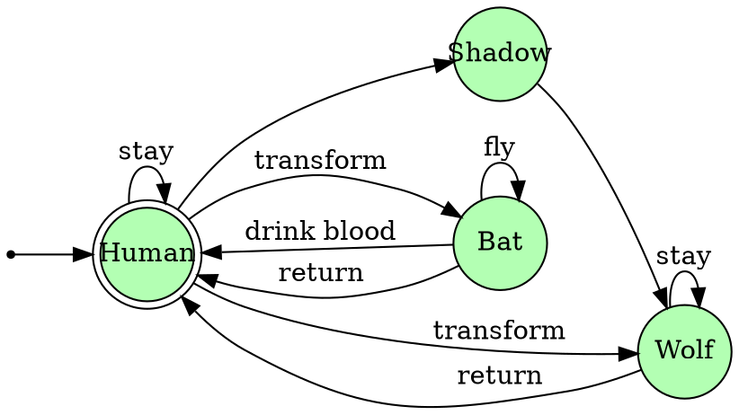

\def\States{\mathcal{S}}
\def\Actions{\mathcal{A}}
\def\R{\mathbb{R}}

What if I told you that some of the most used algorithms to
find the shortest path in a graph,
calculate gradients while training a neural network,
and parse context-free grammars
are essentially implementations of the same idea?
Namely: _dynamic programming_.

I gotta say that I was taught dynamic programming
in many different contexts but it took me a while
to finally get "click" that it they were actually the same thing.
When learning algorithms and data structures,
it was a memoization-based technique were you speed up your algorithm
by first solving the easy parts and saving them for later use.
At work, I mostly deal with solving a lot of linear programs
for long-term scheduling problems.[^sddp]
The main algorithm we use, called _Stochastic Dual Dynamic Programming_,
at first didn't seem so much like the programming technique algorithms class.
Finally, one of the main methods for model-based reinforcement learning
is again called dynamic programming,
and at first it also didn't seem so much like the others instances.

So, what is happening here?
Did everybody choose to call their algorithms dynamic programming
just because it is a cool name?[^dp-name]
Well, in fact there are some principles that apply to all of those instances,
from planning a rocket's trajectory to TeX's word-wrapping.
And the [list goes on and on](https://en.wikipedia.org/wiki/Dynamic_programming#Algorithms_that_use_dynamic_programming).

In this post,
I intend to write about the framework
that encompasses all those problems and how DP fits into it.
The motivation for this came some weeks ago after teaching a colleague
about how can we start with the programming technique and arrive at SDDP.
This post is in fact a more organized/legible version of my notes and diagrams from that day.
By the way, I also recommend reading
Richard Sutton's [The Quest for a Common Model of the Intelligent Decision Maker](https://arxiv.org/pdf/2202.13252.pdf).
It is a great paper about unifying decision frameworks across different fields,
and certainly also inspired this post.

[^sddp]: To be more precise, we work with hydrothermal dispatch problems,
where one must decide between many sources of energy (hydro, thermal, renewable)
to supply a certain power demand taking into account the uncertainties of the future.
For example: hydro is cheap and clean but you risk running out of water
if you use all of it and next month turns out particularly dry.
Finding the best energy dispatch is once again solved via dynamic programming.

[^dp-name]: Even Richard Bellman admittedly [chose because of that](https://en.wikipedia.org/wiki/Dynamic_programming#History).

## On Decision Making and State Machines
Before delving into dynamic programming, we first have to establish a few concepts.
After all, it's always best to know which problems you intend to solve
before learning a method to solve them, right?

As a matter of motivation, let's begin by considering a vampire.
It is common knowledge[^vampire]
that vampires are always in one of four states:
their usual human form, transformed into a bat or a wolf or walking in the shadows.
In the human form, the vampire can choose to turn into one of the animals
or jump into a shadow to enter it.
As a bat, the vampire is able to keep flying or drink a person's blood,
an act that turns him back into human form immediately.
As a wolf he can similarly stay in the form or go back to human.
He is unable to remain much in the shadows,
The vampire can't remain much on the shadows and, for whatever reason,
he is only able to leave them as a wolf.
It seems really complicated to be a vampire, right?
Fortunately, the folks at the Comp Sci department
invented some nice diagrams to help our pointy-toothed friends.

[^vampire]: Definitely citation needed.

Our modeling of a vampire is an stance of something called
a _controllable state machines_ or _automata_ if you're into Greek words.
There are 4 states in which the vampire can be and at each one
there is an available set of actions to take that may transition him to another state.
More abstractly,
an automaton is system that can be in one of many _states_ $s \in \States$
and at each state, you can choose among a set of _actions_ $a \in \Actions(s)$
that transition the system to a new state $s' = T(s, a)$,
where $T$ is called the system's _transition function_.

An important notice: If you come from Computer Science,
you are probably most used to _finite_ state machines.
Just know that in our context, the states may be any set.
Some of the algorithms that we will see today
only work for finite state spaces
but there are others that may even require a continuous space!
An example is SDDP, which uses linear programming duality
and thus requires the state space to be a convex subset of $R^n$.

### Decision Processes

Unfortunately nothing in life comes for free...
And taking an action $a$ in state $s$ has a certain cost $c(s, a)$.
Our simplest decision problem then takes the following format:

> What is the best action to take at state $s$?
That is, which one produces the lowest cost?

Or in math language:

$$
\begin{array}{rl}
  \min\limits_{a} & c(s, a) \\
  \textrm{s.t.}  & a \in \Actions(s).
\end{array}
$$

This is an optimization problem and can be solved by standard techniques,
depending on the nature of the cost function and action set.
If $\Actions(s)$ is finite, one uses combinatorial optimization.
Are they all linear? Linear programming to the rescue.
Convex? Just use convex programming.
I think you get it.

Nevertheless, there is still something missing on the description above.
We used the initial state $s$ and the cost function $c$
to decide which is the best action to take.
But what about the transition function?
I wouldn't introduce it if there was no good use...

In the real world, it is not so common to just want to take an action.
After all, what we do now affects the future.
When we choose our action $a$,
our system will arrive at a new state $T(s, a)$.
Thus we can ask again the same question:
what is the best action to take at this new state?
What we call a _decision process_ is a sequence of actions
whose total cost is the minimum possible over time.
Starting at state $s$,
our decision is a solution to the following optimization problem:

$$
\begin{array}{rl}
  \min\limits_{a} & \sum\limits_{t=1}^\infty \gamma^{t-1}c(s_t, a_t) \\
  \textrm{s.t.}   & s_{t+1} = T(s_t, a_t), \\
                  & s_1     = s, \\
                  & a_t \in \Actions(s_t).
\end{array}
$$

The $\gamma \in [0, 1]$ is a constant called the _discount factor_.
Its use is twofold.
Mathematically, it is useful because
if we have $\gamma < 1$ and the costs are bounded,
we can guarantee that the series converge.
That is, suppose that

$$\forall s \in \States, a \in \Actions(s),\, c(s, a) \le M.$$

This bounds the total cost by a geometric series that cannot blow up,

$$
\sum\limits_{t=1}^\infty \gamma^{t-1}c(s_t, a_t) \le \sum\limits_{t=1}^\infty \gamma^{t-1} M \le \frac{M}{1 - \gamma},
$$

thus guaranteeing that the decision problem is well-posed.

Besides that, there is also a more applied interpretation of $γ$
that is also interesting:
It says that spending in the future in cheaper than expending right now.
So, in an economic context, the discount $γ$ is the same as inflation.
Similarly, if we are programming a robot that gains rewards
(equivalent to negative costs) at each time step,
the discount factor amounts to impatience:
it is better to gain the reward sooner than later.

Now let's take a look on how to model some common problems using this framework.

#### State over time

#### Example: Shortest Path in a Graph

Suppose you are at your home town
and just received a message from friend
telling you that there are singing llamas in Cuzco, Peru, right now.
This makes you at the same time incredulous and curious,
so you just pick your favorite bike and get on the road towards Cuzco.
But unfortunately there are no direct bikeways connecting your home to Cuzco,
meaning that you will have to find a route going through other cities.
Also, there is a risk that the llamas will stop to sing at any time
and just go back to their usual behaviour of eating grass throughout the mountains.
This prompts you to decide to take the shortest path to Cuzco possible.

The above description is an instance of finding the shortest path in a graph.
In it, we represent each city by a graph node and a direct routes between two cities
as a weighted edge where the weight is the distance.
Going from home to Cuzco amounts to finding the path between those two nodes
with the smallest total distance.

The translation from this graph description
to a decision process description is quite straightforward.

* **States**: nodes in the graph.
* **Actions** at state $s$: edges going from $s$ to another node.
* **Transition**: The opposite node on the same edge.
That is, given an edge $s \to s'$, $T(s, s \to s') = s'$.
* **Costs**: $c(s, a)$ is the weight of edge $a$.

Finding the shortest path from $s$ to node $z$
is the same as setting the initial state to $s$ and making $z$
a terminal state of our dynamics.

#### Example: Controllable Dynamical System

## Dynamic Programming

Alright, its finally time to solve those decision problems.
One first attempt could be to search the space of all actions
trying to find the best solution.
But notice that even for finite states and horizon, this may be prohibitively expensive
since the possible candidates grow exponentially with the time steps.
Any practical method will to take into account how this class of problems
naturally breaks apart into separate stages.

Our approach will involve the famous _Bellman principle of optimality_,
which is the cornerstone of dynamic programming.
Taking Bellman's own words on his book [Dynamic Programming](https://press.princeton.edu/books/paperback/9780691146683/dynamic-programming),
it reads as:

> An optimal policy has the property that
whatever the initial state and initial decision are,
the remaining decisions must constitute an optimal policy
with regard to the state resulting from the first decision.

What he calls a _policy_ is a function $\pi : (s : \States) \to \Actions(s)$.
And, of course, a policy is _optimal_ for a decision problem
if it produces the best overall cost possible.

Remember that for a given initial state $s$,
we want to find the sequence of actions that produces
the lowest cumulative cost.
Thus we can think of it not as a single decision
but as a family of decisions parameterized on the initial state.

Let's define the _value function_ $v : \States \to \R$
as the optimal cost for a given initial state:

$$
v(s) =
\begin{array}{rl}
  \min\limits_{a} & \sum\limits_{t=1}^\infty \gamma^{t-1}c(s_t, a_t) \\
  \textrm{s.t.}   & s_{t+1} = T(s_t, a_t), \\
                  & s_1     = s, \\
                  & a_t \in \Actions(s_t).
\end{array}
$$

This seems only a matter of notation but trust me that it will be useful.
Notice now that we can rewrite

### What if the state space is infinite?

## Example: Shortest Path in a Graph

## Example: Backpropagation

# Stochastic Dynamic Programming

## Markov Decision Processes

# SDDP

## Approximations by cuts

## Stagewise independence

https://arxiv.org/pdf/2202.13252.pdf

https://www.mit.edu/~dimitrib/allerton_api_final.pdf
