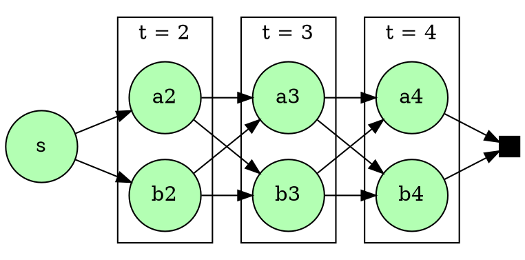

\def\States{\mathcal{S}}
\def\Actions{\mathcal{A}}
\def\R{\mathbb{R}}

What if I told you that some of the most used algorithms to
find the shortest path in a graph,
calculate gradients while training a neural network,
and parse context-free grammars
are essentially implementations of the same idea?
Namely: _dynamic programming_.

I gotta say that I was taught dynamic programming
in many different contexts but it took me a while
to finally get "click" that it they were actually the same thing.
When learning algorithms and data structures,
it was a memoization-based technique were you speed up your algorithm
by first solving the easier parts and saving them for later use.
At work, I mostly deal with solving a lot of linear programs
for long-term scheduling problems.[^sddp]
The main algorithm we use, called _Stochastic Dual Dynamic Programming_,
at first didn't seem so much like the programming technique algorithms class.
Finally, one of the main methods for model-based reinforcement learning
is again called dynamic programming,
and at first it also didn't seem so much like the others instances.

So, what is happening here?
Did everybody choose to call their algorithms dynamic programming
just because it is a cool name?[^dp-name]
Well, in fact there are some principles that apply to all of those instances,
from planning a rocket's trajectory to TeX's word-wrapping.
And the [list goes on and on](https://en.wikipedia.org/wiki/Dynamic_programming#Algorithms_that_use_dynamic_programming).

In this post,
I intend to write about the framework
that encompasses all those problems and how DP fits into it.
The motivation for this came some weeks ago after teaching a colleague
about how can we start with the programming technique and arrive at SDDP.
This post is in fact a more organized/legible version of my notes and diagrams from that day.
By the way, I also recommend reading
Richard Sutton's [The Quest for a Common Model of the Intelligent Decision Maker](https://arxiv.org/pdf/2202.13252.pdf).
It is a great paper about unifying decision frameworks across different fields,
and certainly also inspired this post.

[^sddp]: To be more precise, we work with hydrothermal dispatch problems,
where one must decide between many sources of energy (hydro, thermal, renewable)
to supply a certain power demand taking into account the uncertainties of the future.
For example: hydro is cheap and clean but you risk running out of water
if you use all of it and next month turns out particularly dry.
Finding the best energy dispatch is once again solved via dynamic programming.

[^dp-name]: Even Richard Bellman admittedly [chose because of that](https://en.wikipedia.org/wiki/Dynamic_programming#History).

## On Decision Making and State Machines
Before delving into dynamic programming, we first have to establish a few concepts.
After all, it's always best to know which problems you intend to solve
before learning a method to solve them, right?

As a matter of motivation, let's begin by considering a vampire.
It is common knowledge[^vampire]
that vampires are always in one of four states:
their usual human form, transformed into a bat or a wolf or walking in the shadows.
In the human form, the vampire can choose to turn into one of the animals
or jump into a shadow to enter it.
As a bat, the vampire is able to keep flying or drink a person's blood,
an act that turns him back into human form immediately.
As a wolf he can similarly stay in the form or go back to human.
He is unable to remain much in the shadows,
The vampire can't remain much on the shadows and, for whatever reason,
he is only able to leave them as a wolf.
It seems really complicated to be a vampire, right?
Fortunately, the folks at the Comp Sci department
invented some nice diagrams to help our pointy-toothed friends.

[^vampire]: Definitely citation needed.

Our modeling of a vampire is an stance of something called
a _state machines_ or _automata_ if you're into Greek words.
There are 4 states in which the vampire can be and at each one
there is an available set of actions to take that may transition him to another state.
More abstractly,
an automaton is system that can be in one of many _states_ $s \in \States$
and at each state, you can choose among a set of _actions_ $a \in \Actions(s)$
that transition the system to a new state $s' = T(s, a)$,
where $T$ is called the system's _transition function_.

An important notice: If you come from Computer Science,
you are probably most used to _finite_ state machines.
Just know that in our context, the states may be any set.
Some of the algorithms that we will see today
only work for finite state spaces
but there are others that may even require a continuous space!
An example is SDDP, which uses linear programming duality
and thus requires the state space to be a convex subset of $R^n$.

### Decision Processes

Iterating the transition $T$ establishes a dynamics for our system
where we start at a initial state $s$ and by taking a sequence of actions
$a_1, a_2, \ldots$ we walk over the state space.

$$
\begin{aligned}
    s_1     &= s, \\
    s_{t+1} &= T(s_t, a_t).
\end{aligned}
$$

This new view makes our state machine somewhat equivalent
to a controllable dynamical system,
which is another really cool name in my opinion.

As an example, think of a game of Sudoku.
The states are the (partially numbered) boards
and the actions consist of putting a valid number
in a certain coordinate.
You start with some random board and repeatedly
place numbers until you reach a terminal state
where there are no available actions.

One can argue that since a state encapsulates
all you must know about your system in order to choose an action,
no matter if the previous history nor time step.
Indeed, if those things affect your choice,
then we can without loss of generality model our
problem as a larger system where the state also carries those information.
Thus controlling a dynamic system amounts to
a function $\pi : (s : \States) \to \Actions(s)$
which chooses a valid action for each state.
In the literature this called a _policy_,
in analogy to a government taking actions to run its state.

Unfortunately life is not known for its free lunchs
and in most systems, whenever we take action $a$ at state $s$,
there is a certain cost $c(s, a)$ to pay.
Depending on the context this can be, for example,
a real monetary cost (for economic problems),
some total distance (for planning)
or even a negative cost representing a reward.

Thus, by following a policy $\pi$,
we produce a sequence of cost $c(s_t, \pi(s_t))$
for each time step.
We could define the total cost for $\pi$
as the sum of those costs but there is an additional detail to notice.
If I gave you something and asked if you want to pay me today
or next year, which option would you prefer?
Sometimes there are factors such as inflation or interests
that make costs in the future not have the same actual value
as the costs we expend right now.
This prompts us to introduce a problem dependent _discount factor_ $\gamma \in [0, 1]$
such that the total cost for a policy $\pi$ is

$$
\begin{array}{rl}
 v^\pi(s) = & c(s_1, \pi(s_1)) + \gamma c(s_2, \pi(s_2)) + \gamma^2 c(s_3, \pi(s_3)) + \ldots \\
  \textrm{where}  & s_1     = s, \\
                  & s_{t+1} = T(s_t, a_t), \\
\end{array}
$$

The equation above defines the _value function_ $v^\pi : \States \to \R$
for a given policy $\pi$.
__Spoiler__: keep an eye on the $v^\pi$,
because later on this post we will find them to be useful tools
that are closely related to the memoization techniques
that people usually identify with dynamic programming.

Besides its practical interpretation,
the discount factor $\gamma$ also plays a significant role
from the mathematical point of view.
If $|\gamma| < 1$ and the costs are uniformly bounded
(which is the case for a finite action space, for example)
we can guarantee that the series defining $v^\pi$ converges
for any policy and initial state.
That is, suppose that exists $M > 0$ such that

$$\forall s \in \States, a \in \Actions(s),\, |c(s, a)| \le M.$$

This bounds the total cost by a geometric series that cannot blow up,

$$
\sum\limits_{t=1}^\infty \gamma^{t-1}|c(s_t, \pi(s_t))| \le \sum\limits_{t=1}^\infty \gamma^{t-1} M \le \frac{M}{1 - \gamma},
$$

thus guaranteeing that that the value function is well-defined.

### Optimal Decisions

Having multiple courses of action possible
prompts us to ask which is the best one possible.
When programming a robot to escape a labyrinth,
you want it to take the least amount of time.
When controlling a spaceship towards the moon,
it is important to guarantee that it will use the least amount of fuel.
When brawling at a bar, you want to knock out your foe
with the least injuries possible.
Thus, our problem can be naturally formulated as searching for _optimal policies_:

> Starting at state $s$, find a policy $\pi$ producing
the lowest total cost over time.

Or equivalently in math language:

$$
\begin{array}{rl}
\min\limits_\pi v^\pi(s) =
  \min\limits_{a_t} & \sum\limits_{t=1}^\infty \gamma^{t-1}c(s_t, a_t) \\
  \textrm{s.t.}     & s_1     = s, \\
                    & s_{t+1} = T(s_t, a_t), \\
                    & a_t \in \Actions(s_t).
\end{array}
$$

Right now, this may seem like a big and scary optimization problem
but in fact there is a lot of structure that we can exploit in order to solve it.
This will be the subject of the next section.
Before we continue,
let's go over a little tangent on how to formulate some classical problems
in this decision making framework.

#### Example: State over time

#### Example: Shortest Path in a Graph

Suppose you are at your home town
and just received a message from friend
telling you that there are singing llamas in Cuzco, Peru, right now.
This makes you at the same time incredulous and curious,
so you just pick your favorite bike and get on the road towards Cuzco.
Unfortunately there are no direct bikeways connecting your home to Cuzco,
meaning that you will have to find a route going through other cities.
Also, there is a risk that the llamas will stop to sing at any time
and just go back to their usual behaviour of eating grass throughout the mountains.
This prompts you to decide to take the shortest path to Cuzco possible.

The above description is an instance of finding the shortest path in a graph.
In it, we represent each city by a graph node and a direct routes between two cities
as a weighted edge where the weight is the distance.
Going from home to Cuzco amounts to finding the path between those two nodes
with the smallest total distance.

The translation from this graph description
to a decision process description is quite straightforward.

* **States**: nodes in the graph.
* **Actions** at state $s$: edges going from $s$ to another node.
* **Transition**: The opposite node on the same edge.
That is, given an edge $s \to s'$, $T(s, s \to s') = s'$.
* **Costs**: $c(s, a)$ is the weight of edge $a$.

Finding the shortest path from $s$ to node $z$
is the same as setting the initial state to $s$ and making $z$
a terminal state of our dynamics.

#### Example: Guiding a Rocket

## Dynamic Programming

Alright, its finally time to solve those decision problems.
The simplest idea could be to exhaustively search the space of all actions
trying to find the best solution.
Notice that even for finite states and horizon, this may be prohibitively expensive
since the possible candidates grow exponentially with the time steps.
Any practical method will to take into account how this class of problems
naturally breaks apart into separate stages.

Our approach will involve the famous _Bellman principle of optimality_,
which is the cornerstone of dynamic programming.
Taking Bellman's own words on his book [Dynamic Programming](https://press.princeton.edu/books/paperback/9780691146683/dynamic-programming),
it reads as:

> An optimal policy has the property that
whatever the initial state and initial decision are,
the remaining decisions must constitute an optimal policy
with regard to the state resulting from the first decision.

Alright, what does this mean?
What the principle of optimality is telling us
is that in order to calculate an optimal policy,
we should turn this iterative process of making actions and calculating costs
into a recursive procedure.
That is, taking an action puts us into a new state $s_2 = T(s_1, a_1)$
where we are again faced with the exact same problem of finding an optimal policy
but this time starting at $s_2$.
Let's see how we can exploit this idea.

Remember that we defined the value function $v^\pi$
as the total cost of following a policy $\pi$
when starting at a given state.
Let's define the _optimal value function_ $v^\star$
as the total cost of choosing the best course of action
while starting at a certain state $s$.

$$
\begin{array}{rl}
 v^\star(s) =
  \min\limits_{a_t} & \sum\limits_{t=1}^\infty \gamma^{t-1}c(s_t, a_t) \\
  \textrm{s.t.}     & s_1     = s, \\
                    & s_{t+1} = T(s_t, a_t), \\
                    & a_t \in \Actions(s_t).
\end{array}
$$

Notice in the optimization problem above
that the initial state is only ever used to choose the first action.
Later actions do not depend directly on it but only on its consequences.
This means that we can break the problem into two parts:
calculating a _immediate cost_ dependent on the initial state
and calculating a future cost dependent on all next states.

$$
\begin{array}{rl}
 v^\star(s) =
  \min\limits_{a,a_t} & c(s, a) + \left(
    \begin{array}{rl}
      \min\limits_{a_t} & \sum\limits_{t=2}^\infty \gamma^{t-1}c(s_t, a_t) \\
      \textrm{s.t.}     & s_2 = s', \\
                        & s_{t+1} = T(s_t, a_t), \\
                        & a_t \in \Actions(s_t)
    \end{array}
  \right) \\
  \textrm{s.t.} & s' = T(s, a), \\
                 & a \in \Actions(s).
\end{array}
$$

There's already some recursive structure unfolding in here!
What is still missing consists of noticing that since the sum in the future cost
starts at $t =2$, we can factor out $\gamma$.
By renaming $l = t-1$ we get

$$
\sum\limits_{t=2}^\infty \gamma^{t-1}c(s_t, a_t)
= \gamma \sum\limits_{t=2}^\infty \gamma^{t-2}c(s_t, a_t)
= \gamma \sum\limits_{l=1}^\infty \gamma^{l-1}c(s_l, a_l)
$$

By applying this in the expression for $v^\star$,

$$
\begin{array}{rl}
 v^\star(s) =
  \min\limits_{a} & c(s, a) + \gamma\left(
    \begin{array}{rl}
      \min\limits_{a_l} & \sum\limits_{l=1}^\infty \gamma^{l-1}c(s_l, a_l) \\
      \textrm{s.t.}     & s_1 = s', \\
                        & s_{l+1} = T(s_l, a_l), \\
                        & a_l \in \Actions(s_l)
    \end{array}
  \right) \\
  \textrm{s.t.}  & s' = T(s, a), \\
                 & a \in \Actions(s).
\end{array}
$$

Although this is a really big expression,
it should be straightforward to see that the expression
for the future cost is _exactly_ the optimal value $v\star(s')$
of starting the dynamics at $s' = T(s, a)$.
This way, the principle of optimality express itself mathematically
as a recursive equation that the value for an optimal policy must satisfy.

$$
\begin{array}{rl}
 v^\star(s) =
  \min\limits_{a} & c(s, a) + \gamma v^\star(s') \\
  \textrm{s.t.}  & s' = T(s, a), \\
                 & a \in \Actions(s).
\end{array}
$$

This is called the _Bellman equation_ and all of dynamic programming
consists of method for solving it.

### Solving the Bellman Equation

For this section, let's assume that both
the state $\States$ and action $\Actions(s)$ spaces are finite.
I know that this is not the most general setting
but it encompasses a lot of interesting problems
and is a simpler place to start.
Later I will comment a bit on how one can extend the results in this section
to continuous spaces.

#### Value Iteration

#### Policy Iteration

### What if the state space is infinite?

## Example: Shortest Path in a Graph

## Example: Backpropagation

# Stochastic Dynamic Programming

## Markov Decision Processes

# SDDP

## Approximations by cuts

## Stagewise independence

https://arxiv.org/pdf/2202.13252.pdf

https://www.mit.edu/~dimitrib/allerton_api_final.pdf

https://martin-thoma.com/how-to-draw-a-finite-state-machine/
